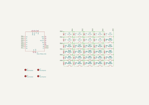
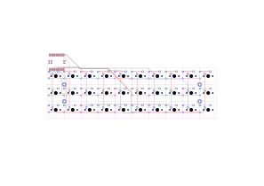
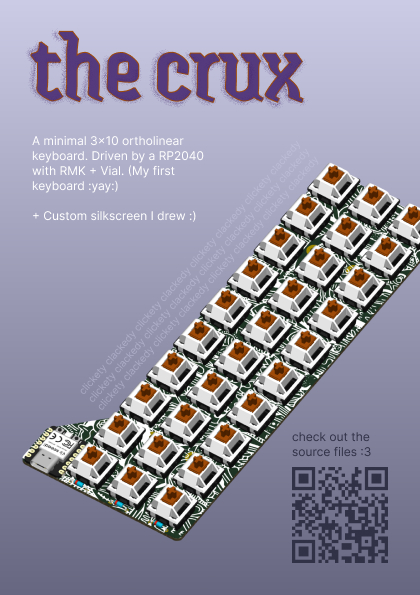

# The Crux

A minimal 3x10 ortholinear keyboard. Driven by a RP2040 with [RMK](https://rmk.rs) + [Vial](https://get.vial.today).

I've always wanted to make a keyboard, I actually started this one with much more ambitious ideas (you can find them in my earlier journals, or by going back the commit history) but realized I should start out with something simpler. So I made this! It was quite nice, and maybe I'll improve it with my previous ideas one-by-one :)

# File structure and assembly

At the top-level there's a general "bom.csv". Then the directories:

- "pcb/" contains a KiCad project and generated production files with KiCAD JLCPCB tools under "pcb/jlcpcb/".
- "standoffs/" contains a FreeCAD file and an exported "standoff.step".
- "images/" contains the images above and the zine in PDF format.
- "firmware/" contains the RMK and Vial firmware. With the compiled UF2 file at "firmware/The_Crux.uf2".

The standoffs are press-fit into the PCB, it's parametric so it can be tuned for different 3D printers.

---

_[Also see this project on Fallout.](https://fallout.hackclub.com/projects/4383)_
